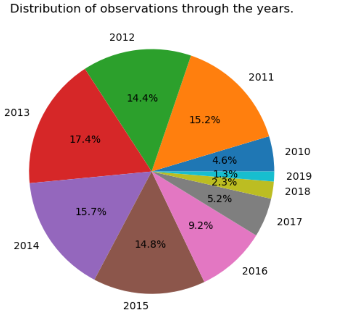

## RHESSI Data Analysis

A Python-based Jupyter Notebook designed for analyzing RHESSI (Reuven Ramaty High Energy Solar Spectroscopic Imager) data released by NASA. The notebook performs in-depth data processing and visualization to derive meaningful inferences from the data. It incorporates advanced analytical methods to uncover trends, correlations, and patterns, presenting the outcomes through insightful graphs and visualizations. 

This tool is suitable for solar physics research, enabling efficient exploration and interpretation of high-energy solar phenomena.

<table border="0" cellspacing="0" cellpadding="0">
    <tr>
      <td style="padding-right: 30px;">
        
      </td>
      <td style="vertical-align: middle; font-size: 12px; font-weight: bold;">
        Access full inference and data explanations.  
        
      </td>
    </tr>
</table>

### Graphs at a glance: 

<table border="1" cellspacing="15" cellpadding="15">
  <tr>
    <td align="center">
       
      
Values showing linear relationships

    </td>
    <td align="center">
       
      
Variance of EPSY w.r.t Latitudes and Longitudes

    </td>
    <td align="center">
       
      
R_value w.r.t parameters

    </td>
  </tr>
  <tr>
    <td align="center">
       
      
Temperature vs no. of sunspots over the years

    </td>
    <td align="center">
       
      
Geographical Distribution of active regions

    </td>
    <td align="center">
       
      
EPSY, EPSX, EPSZ in 3D

    </td>
  </tr>
  <tr>
    <td align="center">
       
      
Grid plots

    </td>
    <td align="center">
       
      
Heatmaps for more visualizations

    </td>
    <td align="center">
       
      
Animation for flares/month

    </td>
  </tr>
  <tr>
    <td align="center">
       
      
Observations through the years

    </td>
    <td align="center">
       
      
Mean shear and other polarity inversion study

    </td>
    <td align="center">
       
      
Solar Flare distribution

    </td>
  </tr>
</table>

