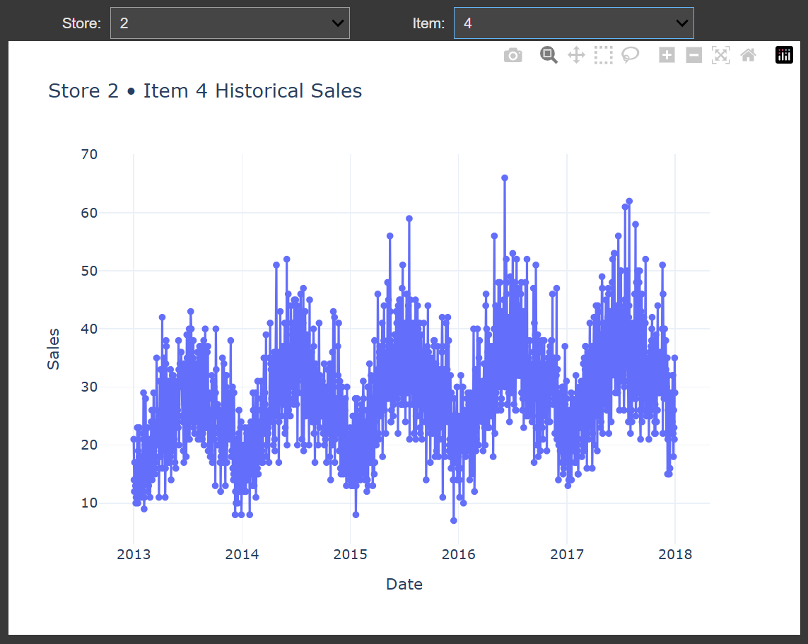
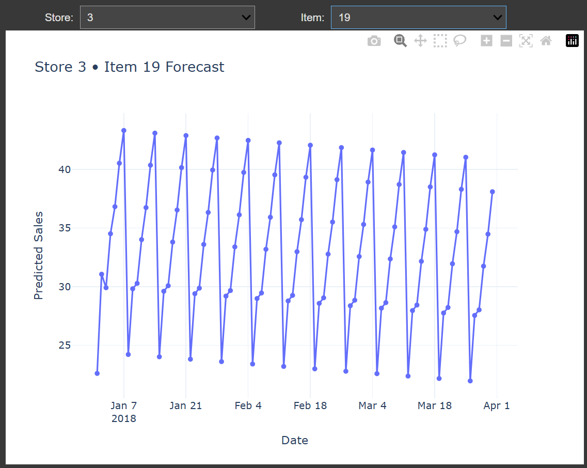

## ARIMA Time series forecasting

Problem statement is to predict 3 months of item-level sales data at different store locations. 

Data contains 5 years of store-item sales data, for 50 different items at 10 different stores.

Build an ARIMA model.

Use SMAPE metric for model evaluation - https://en.wikipedia.org/wiki/Symmetric_mean_absolute_percentage_error

Data fields
date - Date of the sale data. There are no holiday effects or store closures.
store - Store ID
item - Item ID
sales - Number of items sold at a particular store on a particular date.

<table border="0" cellspacing="0" cellpadding="0">
    <tr>
      <td style="padding-right: 30px;">
        
      </td>
      <td style="vertical-align: middle; font-size: 12px; font-weight: bold;">
        Access full inference and data explanations.  
        
      </td>
    </tr>
</table>

### Graphs at a glance: 

<table border="1" cellspacing="15" cellpadding="15">
  <tr>
    <td align="center">
       
      
Explore the training data

    </td>
    <td align="center">
       
      
See the predictions properly

    </td>
  </tr>
  </table>
  

